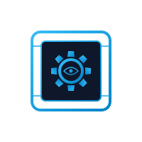

<h1 align="center">
  <br>
  cogbox
</h1>

<p align="center">
  A NixOS <a href="https://github.com/microvm-nix/microvm.nix">microvm</a> sandbox for running coding-agent harnesses with permission prompts disabled.
</p>

Each harness's host config and auth tokens are mounted into an isolated
QEMU guest where the agent can read, write, and run commands without
prompting -- without that blast radius reaching the host.

Currently supported harnesses: `claude-code`
([Claude Code](https://docs.anthropic.com/en/docs/claude-code)),
`opencode` ([opencode](https://github.com/sst/opencode)),
`codex` ([OpenAI Codex CLI](https://github.com/openai/codex)),
`hermes-agent` ([Hermes Agent](https://github.com/NousResearch/hermes-agent)),
and `pi` ([pi coding agent](https://github.com/earendil-works/pi)). Codex is
opt-in and **disabled by default** (its Rust build is slow); enable it by
setting `enableCodex = true` in `flake.nix`. The architecture is
harness-agnostic; see [Harnesses](docs/harnesses.md) for the model and
how to add more.

## Quick start

```
nix run github:illustris/cogbox
```

On first run, the wrapper asks which harnesses to set up (only the ones
you pick get host-side config dirs created) and then prompts before
touching anything (the list reflects which harnesses were built in, so
`codex` appears only when `enableCodex` is on):

```
No harness state detected. Set up which?
  [1] claude-code     (creates ~/.claude/, ~/.claude.json)
  [2] opencode        (creates ~/.config/opencode/, ~/.local/share/opencode/)
  [3] all
Choice [1-3, comma-separated for multiple]:

The following paths will be created:
  ~/.config/cogbox/instances/default/config.json  (default settings)
  ~/.config/cogbox/authorized_keys  (SSH public keys; seeded from ~/.ssh/*.pub + ssh-add -L)
  ~/.local/share/cogbox/cogbox_ed25519  (cogbox's own SSH key, the default identity for `cogbox ssh`)
  ~/.local/share/cogbox/instances/default/  (VM data)
  ...

Continue? [y/N]
```

The VM then starts in the background and, by default, `cogbox` waits for
the guest's SSH server to come up and drops you straight into an SSH
session. When you exit the session the VM keeps running (stop it with
`cogbox stop`). Pass `--no-ssh` to just start it and return, or `-f` to
watch it boot on the serial console instead (`Ctrl-]` detaches without
stopping the VM).

The package installs the CLI as both `cogbox` and `cbx` (a short alias
symlink); once it's on your `PATH`, the two names are interchangeable
(`cbx stop`, `cbx list`, ...).

Each enabled harness ships a launcher inside the VM: `c` for
`claude-code`, `oc` for `opencode`, `cx` for `codex`, `h` for
`hermes-agent`, `p` for `pi`. All the binaries are installed
unconditionally (subject to per-architecture availability), so once the
VM boots any of them is on `$PATH`.

## Documentation

| Doc | Contents |
|---|---|
| [Network filtering](docs/network-filtering.md) | Network modes; L4 CIDR rules; TCP destination remap (SOCKS5); L7 vhost filtering with terminate/passthrough tiers and path constraints; threat model and enforcement internals |
| [Per-instance extensions](docs/extensions.md) | Extending one instance's NixOS config through its `flake/flake.nix` |
| [Plugins](docs/plugins.md) | Installable, versioned extensions: the flake contract, pinning, plugin-supplied firewall rules, the generated composition flake |
| [Harnesses](docs/harnesses.md) | The harness model, per-harness full-auto wiring, adding a harness |
| [Internals](docs/internals.md) | Directory layout, runtime dir + 9p shares, fw_cfg injection, launch-time patching, re-exec mechanism, host path overrides |

## Named instances

Run multiple isolated VMs simultaneously, like Wine prefixes. Each named
instance gets its own data directory, overlay image, and network ports.

```sh
# Default instance (starts in the background, then SSHes in)
nix run github:illustris/cogbox

# Create and start a named instance
nix run github:illustris/cogbox -- --name work
nix run github:illustris/cogbox -- --name personal --vcpu 8 --mem 16384

# List all instances and their ports
nix run github:illustris/cogbox -- list
```

Ports are auto-assigned when an instance is first created (default starts
at SSH 2222 / HTTP 8080; each new instance increments by one), including a
per-instance L7 port triple (`l7PortBase`). Override by editing the
instance config. Those values are only kept disjoint among *your own*
instances; on a shared multi-user host another user's instance may already
hold them (passt and the L7 proxy bind the host's shared loopback). When that
happens, `cogbox start` slides each conflicting port/triple to the next free
one at launch and persists the new value back to the instance config.

Harness authentication and base config are shared across all instances;
each instance overlays its own changes on top, so per-instance harness
settings persist independently (see [Harnesses](docs/harnesses.md)).

The guest's hostname is `cogbox-<instance>` (e.g. `cogbox-work`), and
interactive shells start in `~/work` (a symlink into the persisted host-shared
data dir), the standardized project workdir where plugin kits are materialized.

## CLI

cogbox uses a verb-based CLI. Bare `cogbox` (no verb) is sugar for
`cogbox start`. The VM always runs as a background daemon; its serial
console and QEMU monitor live on per-instance Unix sockets, so you can
attach and detach (`Ctrl-]`) freely without stopping the VM.

| Verb | Description |
|---|---|
| `start` | Init if needed, launch in the background, then SSH in (default verb). `--no-ssh` just returns; `-f` attaches the serial console. |
| `console` | Attach the serial console of a running instance (`Ctrl-]` detaches) |
| `monitor` | Attach the QEMU (HMP) monitor of a running instance |
| `stop` | Stop a running instance (SIGTERM, then SIGKILL with `--force`) |
| `restart` | `stop` then `start` |
| `status` | Print whether an instance is running, plus ports/net mode |
| `list` | List all instances. `--json` for machine-readable output |
| `init` | Create config + host directories without launching |
| `delete` | Delete an instance's config + persistent files (refuses if running; `-y` skips the prompt) |
| `ssh` | Connect to a running instance via SSH |
| `rules` | Manage CIDR (L4) allow/deny rules -- [docs](docs/network-filtering.md#l4-cidr-rules) |
| `remap` | Manage TCP destination-remap rules -- [docs](docs/network-filtering.md#tcp-destination-remap) |
| `l7` | Manage L7 (vhost) allow/deny rules -- [docs](docs/network-filtering.md#l7-host-filtering) |
| `plugin` | Manage guest plugins -- [docs](docs/plugins.md) |
| `help` | `cogbox help VERB` ≡ `cogbox VERB --help` |

Run `cogbox VERB --help` for verb-specific options.

### Common options

| Flag | Verbs | Description |
|---|---|---|
| `-n, --name NAME` | every verb that takes an instance | Instance name (default: `default`) |
| `-h, --help` | every verb | Show help and exit |
| `--no-ssh` | `start` | Don't auto-SSH after launch; start in the background and return |
| `-f, --foreground` | `start` | Attach the serial console after launch instead of SSHing |
| `-y, --yes` | `start`, `init`, `plugin`, `delete` | Skip the harness-selection prompt on first init / plugin and delete confirmation prompts |
| `--vcpu N` | `start`, `init` | vCPU count (default: config.json or 16) |
| `--mem N` | `start`, `init` | RAM in MB (default: config.json or 32768) |
| `--network MODE` | `start`, `init` | `full`, `none`, or `rules` (default: rules) |
| `--no-auto-keys` | `start`, `init` | Leave `authorized_keys` empty instead of seeding, and skip generating cogbox's own SSH key |
| `--force` | `stop` | Send SIGKILL after 10s if SIGTERM doesn't exit the process |
| `--json` | `list` | Emit one JSON object per instance |

When an instance is first created, `--vcpu`, `--mem`, and `--network` are
saved to its `config.json`. On subsequent runs they override the config for
that run only.

### Exit codes

| Code | Meaning |
|---|---|
| 0 | success |
| 3 | `status`: instance is stopped |
| 64 | EX_USAGE: bad CLI args, unknown verb, unknown flag |
| 65 | EX_DATAERR: invalid CIDR, integer, name |
| 66 | EX_NOINPUT: missing config (instance never inited) |
| 70 | EX_SOFTWARE: internal/system error |
| 75 | EX_TEMPFAIL: already running, port collision |

### Examples

```sh
# Lifecycle
cogbox init --name work             # create without starting
cogbox --name work                  # start + SSH in
cogbox ssh --name work htop         # one-off remote command
cogbox status --name work
cogbox stop --name work
cogbox delete --name work            # remove its config + persistent files

# Console access
cogbox -f                           # start and watch it boot
cogbox console                      # attach the console later
cogbox monitor                      # QEMU monitor ((qemu) prompt)
```

## Network filtering

The default `rules` mode gives the sandbox working public internet while
blocking LAN, link-local, and cloud-metadata ranges. On top of that, L7
rules whitelist individual vhosts behind shared IPs, with TLS termination
for `Host`/path enforcement. Rule edits hot-reload into a running VM.

```sh
cogbox rules add allow 192.168.1.50/32 --at 8    # open one LAN host (position matters)
cogbox l7 add allow api.example.com              # one vhost, not its LB siblings
cogbox l7 add allow git.example.com --path /myorg/
nix run github:illustris/cogbox -- --network none   # or: no network at all
```

First match wins and position matters; L7 has two tiers (terminate
default, passthrough for cert-pinned clients) and several deliberate
caveats. For the OAuth harnesses, the terminate tier also injects the real
token host-side by default, so the long-lived credential stays out of the
sandbox and the guest carries only a stub. **Read
[network filtering](docs/network-filtering.md)** for rule semantics, the
L4/L7 composition table, [host-side credential
injection](docs/network-filtering.md#host-side-credential-injection), the
threat model, and the enforcement internals.

## Configuration

All settings are in `~/.config/cogbox/` (or `$XDG_CONFIG_HOME/cogbox/`),
one subdir per instance under `instances/<name>/`. Edit and restart the
VM -- no rebuild needed.

### config.json

```json
{
    "vcpu": 16,
    "mem": 32768,
    "sshPort": 2222,
    "httpPort": 8080,
    "overlaySize": "128M",
    "storeOverlaySize": "16G",
    "bindAddr": "127.0.0.1",
    "network": {"rules": [...]}
}
```

| Key | Type | Default | Description |
|---|---|---|---|
| `vcpu` | int | 16 | Virtual CPUs |
| `mem` | int | 32768 | RAM in megabytes |
| `sshPort` | int | 2222 | Host port forwarded to guest SSH (22) |
| `httpPort` | int | 8080 | Host port forwarded to guest 8080 |
| `overlaySize` | string | `128M` | Persistent harness overlay image |
| `storeOverlaySize` | string | `16G` | Writable nix store tmpfs |
| `bindAddr` | string | `127.0.0.1` | Host bind address for port forwards |
| `network` | string/object | seeded `rules` | `"full"`, `"none"`, or `{"rules":[...]}` |
| `l7PortBase` | int | 18443 | Base of the instance's L7 loopback port triple |
| `plugins` | array | absent | Managed by `cogbox plugin` -- see [Plugins](docs/plugins.md) |

Only include the keys you want to change -- missing keys use the defaults.

### authorized_keys

SSH public keys, one per line. On first init the shared file
(`~/.config/cogbox/authorized_keys`) is seeded from `~/.ssh/*.pub` plus
any keys in the running ssh-agent; pass `--no-auto-keys` to keep it
empty. A per-instance `instances/<name>/authorized_keys` overrides the
shared file. Without SSH keys, the VM console is accessible directly
(root autologin is enabled).

In addition, cogbox manages its own keypair at
`~/.local/share/cogbox/cogbox_ed25519` and unions its public key into
every guest's `authorized_keys` at launch, so `cogbox ssh` connects out
of the box without relying on your personal keys. It pins ssh to this key
alone (`-i` plus `IdentitiesOnly=yes` and `IdentityAgent=none`), so your
agent and `~/.ssh` keys are not offered and no agent is contacted -- a
gpg-agent with ssh support can't stall or prompt on connect. The private
key stays on the host -- it lives beside, not inside, the per-instance
data mounted into a VM, and is reused across all instances. (Under
`--no-auto-keys`, where no cogbox key exists, `cogbox ssh` instead falls
back to your agent and `~/.ssh` keys.)

`--no-auto-keys` at first init skips generating this key and records the
opt-out (at `~/.config/cogbox/no-cogbox-key`), so a later plain `cogbox
start` won't silently re-create it -- the guest stays reachable only via
the console. To opt back in, remove that marker. To rotate the key,
delete `~/.local/share/cogbox/cogbox_ed25519*`; the next launch (without
`--no-auto-keys`) regenerates it.

### Extending the guest

Two mechanisms, both folding NixOS modules into the instance's VM:

- **[Per-instance flake](docs/extensions.md)** -- edit
  `instances/<name>/flake/flake.nix` to add packages, services, mounts;
  applied on the next start.
- **[Plugins](docs/plugins.md)** -- install versioned extensions from any
  flake URL, optionally with the firewall rules they need:

  ```sh
  cogbox plugin add github:myorg/myplugin?dir=flake
  cogbox plugin add 'github:org/observability#loki' -n work
  cogbox plugin update
  ```

Host-side data locations can be overridden with `COGBOX_*` environment
variables -- see [Internals](docs/internals.md#host-side-path-overrides).

## Defaults

| Resource | Value |
|---|---|
| vCPUs | 16 |
| RAM | 32 GB |
| Writable nix store | 16 GB tmpfs overlay |
| Harness overlay (shared) | 128 MB ext4 image, per-harness subdirs |
| SSH | 127.0.0.1:2222 -> 22 |
| HTTP | 127.0.0.1:8080 -> 8080 |
| Network | rules (private/bogon denied, public allowed) |
| Docker | enabled |

Pre-installed tools: core — `git`, `curl`, `jq`, `vim`, `ncdu`, `tmux`, `htop`, `nixfs`; search/files — `ripgrep`, `fd`, `bat`, `sd`; data wrangling — `yq-go`, `duckdb`, `miller`, `dasel`, `gron`, `datamash`, `jo`; HTTP/DNS/web — `xh`, `websocat`, `dnsutils`, `htmlq`, `pup`; shell glue — `moreutils` (plus `xargs -P` for parallelism).
Harness binaries (with launchers): `claude-code` (`c`) and `opencode`
(`oc`), on `x86_64-linux` and `aarch64-linux` (sourced from
`numtide/llm-agents.nix`). `codex` (`cx`) is opt-in (see above) and built
in only when `enableCodex` is set.
Architecture-conditional extras: `bpftrace` (x86_64, aarch64), `nix-mcp`
(where the `nix-mcp` flake publishes a build).

## Limitations

- Linux host with KVM. Build targets: `x86_64-linux`, `aarch64-linux`,
  `riscv64-linux`.
- Per-harness platform availability varies. `claude-code`, `opencode`,
  `codex`, `hermes-agent`, and `pi` all come from
  `numtide/llm-agents.nix`, which builds them for `x86_64-linux` and
  `aarch64-linux` only.
- One instance per name at a time (PID lock per runtime directory).
  Multiple differently-named instances can run simultaneously.
- The writable nix store overlay is a tmpfs -- installed packages do not
  persist across VM reboots (but see
  [pre-populating the store](docs/extensions.md#example-pre-populate-the-nix-store-with-build-deps)).
- Changing `overlaySize` only affects newly created overlay images; delete
  the overlay image to recreate with a new size.
- Network `rules` mode filters at the passt syscall level; traffic
  handled internally by passt (ARP, DHCP, gateway ping responses) is not
  subject to user rules. See
  [enforcement internals](docs/network-filtering.md#enforcement-internals).
